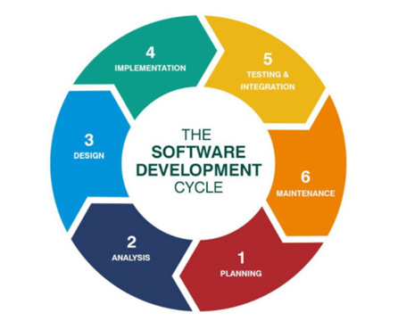

# 1140 - Databases Week One Notes
#### by Bryce Tuppurainen

## Basic Database Acronyms

### DBMS – Database Management System
Communicates between the application/s and the database directly through some structured language, such as SQL.

### SQL – Structured Query Language

A standard set of instructions in given syntax to provide instructions for a DBMS to interact with a database.

### CHAOS Report – TLDR;

Bad stuff happens, ~30% of software projects fail to launch

### SDLC – Software Development Lifecycle

These patterns are used to manage the design and development (time constraints, and documentation standards, etc) of software for some elicited requirement/s

An example of common SDLC – There are many similar models

## RCLP – A DBMS design pattern

After performing the systems engineering to determine what the requirements are, and how to verify and validate the solution. The following are identified to determine the systems overall design and construction.

- ### Requirements
    - What types of data need to be stored? monetary values, dates, names, …
    - Who are the actors? What permissions does each need and why?
    - Do any business rules apply? What are they? Does the system need to be secure? If so, how?

- ### Conceptual

    - Design an entity-relationship model which encapsulates the requirements of the system with the actors.
    - Domain and design class diagrams

- ### Logical
    - Sequence and activity diagrams for the DBMS. How does it perform each function?

- ### Physical
    - What are the actual minimum specifications required on the hardware? How does this affect the system as a whole?
    - How and where can the database be accessed and stored in the real-world?
